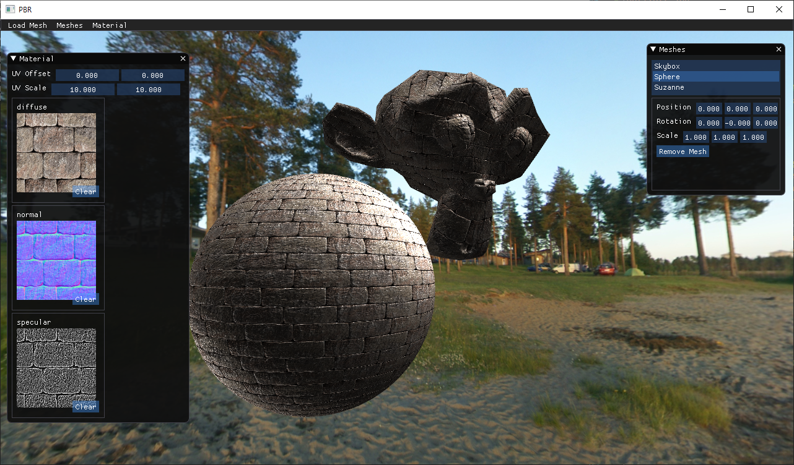

# PBR
PBR 등 Rendering 공부를 위한 Mesh Viewer.

- [x] 기본적인 Phong Shading
- [x] Normal Mapping
- [x] Phong Shading 에 Multiple Light caster 적용
- [x] CubeMap, Environmental Mapping
- [ ] IMGUI Dialog 에서 파일을 다시 선택할 때 발생하는 버그 수정
- [ ] Light를 화면에 실제로 그리기(Debug)
- [ ] Material 추가 및 제거를 위한 UI 로직
- [ ] PBR